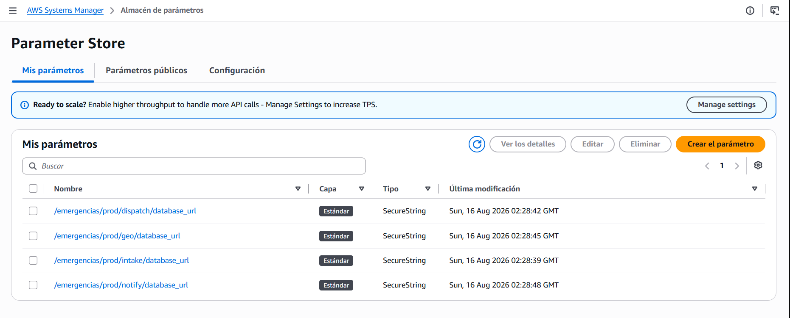
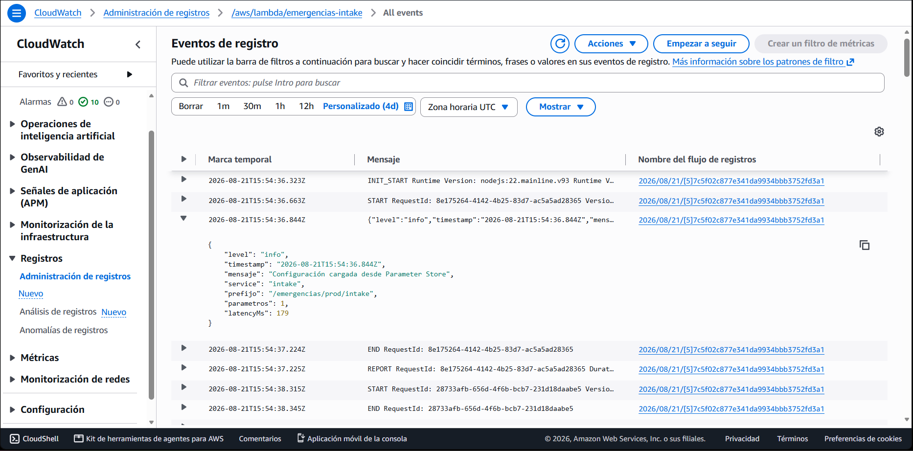
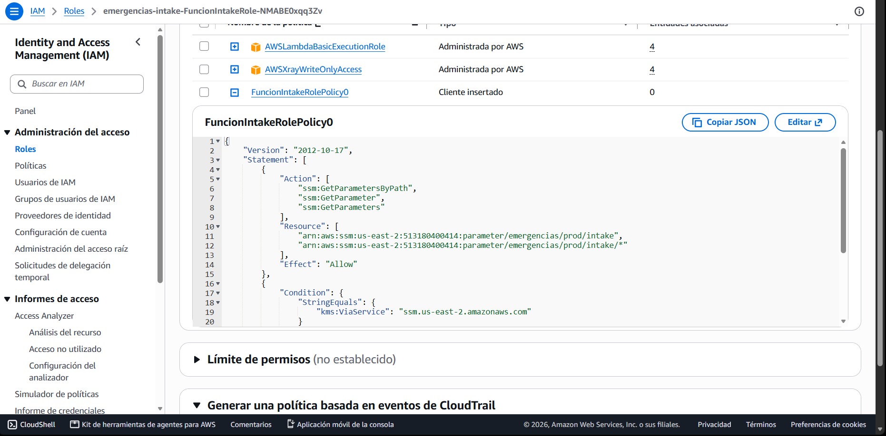
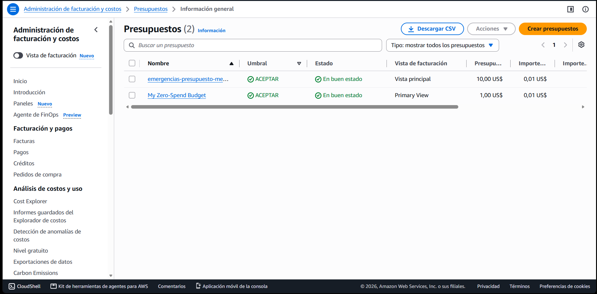

# emergencias-co-backend

Backend serverless para gestión de emergencias tras el sismo de 2026 en Chocó, Pereira, Cali y Manizales.
Parcial 1 — Patrones Arquitectónicos Avanzados.

Cuatro microservicios autónomos desplegados en AWS Lambda detrás de un API Gateway REST, con
despliegue progresivo Canary y rollback automático.

### Stack

- **Runtime** — Node.js 22, TypeScript 5.8, esbuild (bundling), Docker (demostración local).
- **AWS** — Lambda (alias `prod`), API Gateway REST, SQS, SAM/CloudFormation, CodeDeploy (canary + rollback), CloudWatch (alarmas), Parameter Store (`SecureString`), Budgets.
- **Datos** — Supabase (fuente de la verdad), PostgreSQL 17, PostGIS, Row Level Security forzada.
- **CI/CD y seguridad** — GitHub Actions, GitHub OIDC (sin llaves estáticas), gitleaks (pre-commit + CI).
- **Frontend** — repositorio aparte: [`emergencias-co-frontend`](https://github.com/Firewallrbn/emergencias-co-frontend) — Next.js 16, React 19, Tailwind 4, MapLibre GL, Vercel.

## Estructura

```
packages/shared/     Utilidades transversales: config desde SSM (cache-aside),
                     logger estructurado, retry con backoff+jitter, circuit breaker, pool pg
services/intake/     Recepción de reportes, triage determinístico P1-P4, idempotencia, publica en SQS
services/dispatch/   Consume SQS, asigna unidades por proximidad (ST_DWithin)
services/geo/        Clustering geoespacial de puntos calientes y zonas aisladas
services/notify/     Notificaciones y broadcast de estado
infra/               API Gateway REST, AWS Budgets, rol OIDC de despliegue
db/migrations/       SQL versionado e idempotente (schemas, PostGIS, RLS)
scripts/             Credenciales, validación de migraciones, verificadores de tráfico y del canary
docs/                Diagramas C4, manual de despliegue, evidencias
```

Cada servicio tiene su propio `template.yaml` (stack SAM independiente) y su propio workflow en
`.github/workflows/`, disparado por `paths:` — ciclo de vida de CI/CD por microservicio.

## Política de secretos

**No existe ningún `.env` versionado en este repositorio, ni debe existir jamás — tampoco en el historial.**

- Los servicios leen su configuración de **AWS Systems Manager Parameter Store** (`SecureString`) en el
  cold start, bajo el prefijo `/emergencias/prod/<servicio>/`.
- Cada función Lambda tiene un rol IAM que solo puede leer **su propio** prefijo de parámetros.
- El CI se autentica con **GitHub OIDC** contra un rol IAM: cero llaves estáticas en GitHub Secrets.
- Las Lambdas **no usan la `service_role` key de Supabase**. Cada servicio se conecta con su propio rol
  Postgres, de modo que RLS sigue aplicando también al backend.
- El `.env` que consume `docker compose` **se genera** desde Parameter Store con
  `scripts/preparar-env-local.ps1` y está en `.gitignore`. Nunca se escribe a mano ni se comparte.

Guarda activa: `gitleaks` corre como hook de pre-commit y como job de CI.

```bash
git config core.hooksPath .githooks   # una vez por clon
```

## Requisitos locales

| Herramienta | Versión usada |
|---|---|
| Node.js | 22+ |
| Docker | 29+ (daemon corriendo) |
| AWS CLI | v2 |
| AWS SAM CLI | 1.165+ |
| gitleaks | 8.30+ |
| psql | 17+ |

## Demostración local

Los contenedores son los mismos en los dos modos; lo único que cambia es contra qué base hablan.

### Modo por defecto — contra Supabase

```powershell
.\scripts\preparar-env-local.ps1      # una vez por clon
docker compose up --build
curl http://localhost:8080/v1/health
```

**Supabase es la fuente de la verdad.** Los contenedores no llevan base propia: se conectan al mismo
Postgres gestionado que usan las Lambdas de producción, por el pooler en modo transacción (puerto 6543)
y con TLS. Lo que se escriba aquí queda escrito de verdad, y lo que se lea es el estado real del
sistema — el frontend desplegado en Vercel y estos contenedores ven exactamente los mismos datos.

`preparar-env-local.ps1` descarga las cuatro cadenas de conexión de Parameter Store y las materializa
en un `.env` local; requiere la AWS CLI autenticada. Cada servicio recibe **su propio rol** Postgres
(`svc_intake`, `svc_dispatch`, …), nunca la `service_role` key: así RLS también se aplica al backend.

### Modo autocontenido — sin cuenta de AWS ni de Supabase

```bash
docker compose -f docker-compose.yml -f docker-compose.local.yml up --build
curl http://localhost:8080/v1/health
```

Añade un PostGIS efímero con las migraciones y el seed ya aplicados. **No hace falta ninguna
credencial**: cualquiera puede clonar el repositorio y levantarlo. A cambio, los datos son los del
seed y mueren con `docker compose down`.

Este modo existe porque una demostración que solo funciona en la máquina del autor no es una
demostración.

### En cualquiera de los dos

```bash
# Un reporte completo
curl -X POST http://localhost:8080/v1/emergencias \
  -H 'Content-Type: application/json' \
  -H 'Idempotency-Key: demo-001' \
  -d '{"tipo":"usar_medica","ciudad":"cali",
       "descripcion":"Estructura colapsada con personas atrapadas",
       "coordenadas":{"lon":-76.523,"lat":3.452},
       "datos":{"personas_atrapadas":3,"riesgo_inminente":["fuego"]}}'

# Repetir con la misma clave: devuelve el mismo id y duplicado:true
# Puntos calientes detectados por DBSCAN
curl http://localhost:8080/v1/zonas/cali/clusters

# Inspeccionar la base (solo en modo autocontenido)
psql -h localhost -p 55433 -U postgres
```

Dos diferencias con producción, ambas visibles en la respuesta y en los logs:

- **No hay SQS**, así que las emergencias se registran pero no se encolan para despacho.
  La respuesta lo dice: `"despacho_encolado": false`.
- **En modo autocontenido la contraseña de la base está a la vista** en `docker-compose.local.yml`.
  Es correcto: protege un contenedor efímero que se destruye con `docker compose down`, sin un solo
  dato real dentro. Los secretos de verdad viven en Parameter Store y se generan con
  `scripts/configurar-credenciales.ps1`.

## Despliegue

El despliegue es automático: un push a `main` que toque `services/<svc>/**` empaqueta el servicio con
esbuild y ejecuta `sam deploy`, que dispara un despliegue Canary (10 % durante 5 minutos) vigilado por
alarmas de CloudWatch. Si alguna alarma se activa, CodeDeploy revierte al 100 % de la versión anterior
sin intervención manual.

> El enunciado pide imágenes en ECR; el equipo desplegó como paquete zip por costo. Es una desviación
> deliberada y documentada, no un olvido: los `Dockerfile` siguen vivos y son los que levantan la
> demostración local.

El manual reproducible desde cero está en [`docs/manual-despliegue.md`](docs/manual-despliegue.md).

---

## Mapa de la entrega

Dónde se evidencia cada punto exigido en la sección 9 del enunciado.

### 1. Repositorios de código

| Qué | Dónde |
|---|---|
| Backend | https://github.com/Firewallrbn/emergencias-co-backend |
| Frontend | https://github.com/Firewallrbn/emergencias-co-frontend |
| Pipeline de CI — escaneo de secretos, tipos, pruebas y empaquetado | [`.github/workflows/ci.yml`](.github/workflows/ci.yml) |
| Pipeline de CD por microservicio — `sam deploy` con canary, disparado por `paths:` | [`.github/workflows/deploy.yml`](.github/workflows/deploy.yml) |
| Ausencia de secretos, verificable | [`.gitleaks.toml`](.gitleaks.toml), hook [`.githooks/pre-commit`](.githooks/pre-commit) y job de CI. Reproducible con `npm run scan`, que recorre **todo el historial** (`--log-opts=--all`) |
| Política de secretos, explicada | [Política de secretos](#política-de-secretos), arriba en este README |

El CI se autentica en AWS por **OIDC** ([`deploy.yml:123`](.github/workflows/deploy.yml#L123)): no hay
una sola llave estática en GitHub Secrets, solo el ARN del rol a asumir.

### 2. URLs de producción

| Qué | Dónde |
|---|---|
| Frontend activo en Vercel | https://emergencias-co-frontend.vercel.app/ |
| Endpoint base de API Gateway, etapa `prod` | https://rdrlxnfz59.execute-api.us-east-2.amazonaws.com/prod |

La URL del API Gateway es la salida `UrlBase` del stack `emergencias-gateway`
([`infra/gateway.yaml:386`](infra/gateway.yaml#L386)). Se recupera con:

```bash
aws cloudformation describe-stacks --stack-name emergencias-gateway \
  --query "Stacks[0].Outputs[?OutputKey=='UrlBase'].OutputValue" \
  --output text --region us-east-2
```

### 3. Informe técnico arquitectónico

**Diagramas y flujos**

| Qué | Dónde |
|---|---|
| Diagrama C4 — contexto, contenedores y componentes | [`docs/arquitectura-c4.md`](docs/arquitectura-c4.md), niveles 1 a 3 |
| Flujo de despliegue Canary | [`docs/arquitectura-c4.md`](docs/arquitectura-c4.md), sección *Flujo de despliegue Canary* |
| Feature flag de inyección de fallo | [`docs/evidencias/rollback-canary.md`](docs/evidencias/rollback-canary.md) — la constante `__CAOS__` que esbuild sustituye en tiempo de compilación, de modo que cambia el bundle y con él su hash |
| Flujo de un reporte, de principio a fin | [`docs/arquitectura-c4.md`](docs/arquitectura-c4.md), última sección |
| Manual de despliegue reproducible desde cero | [`docs/manual-despliegue.md`](docs/manual-despliegue.md) |

**Consumo de secretos desde Parameter Store**

| Qué | Dónde |
|---|---|
| Implementación — cache-aside sobre SSM, una sola lectura por contenedor | [`packages/shared/src/config.ts`](packages/shared/src/config.ts) |
| Publicación de los secretos como `SecureString`, sin pasar por disco, pantalla ni historial del shell | [`scripts/configurar-credenciales.ps1`](scripts/configurar-credenciales.ps1) |
| Procedimiento paso a paso | [`docs/manual-despliegue.md`](docs/manual-despliegue.md), sección 5 |

Que los parámetros existan y que se consuman son dos afirmaciones distintas: la primera captura
prueba la primera, y el log de CloudWatch prueba la segunda. La política IAM cierra el argumento —
cada función solo alcanza su propio prefijo, así que una credencial filtrada no abre las otras tres.

**Los cuatro parámetros existen y están cifrados** — los 4 `database_url` como `SecureString`, sin descifrar:



**Se consumen de verdad en tiempo de ejecución** — la línea que emite `config.ts` en el log de `emergencias-intake`, con `prefijo`, `parametros` y `latencyMs`:



**Rol IAM por función, limitado a su propio prefijo** — el `Resource` de la política acotado a `parameter/emergencias/prod/intake/*`, no a `*`. Declarado en `services/<svc>/template.yaml`:



**AWS Budgets y alertas**

| Qué | Dónde |
|---|---|
| Plantilla del presupuesto — techo mensual, alerta sobre gasto real y alerta anticipada sobre gasto proyectado | [`infra/budgets.yaml`](infra/budgets.yaml) |
| Procedimiento de despliegue del presupuesto | [`docs/manual-despliegue.md`](docs/manual-despliegue.md), sección 2 |
| Las dos alertas asociadas — `ACTUAL > 50 %` y `FORECASTED > 85 %` | <!-- PENDIENTE: añadir a docs/evidencias/ --> |

**Presupuesto activo en la consola** — `emergencias-presupuesto-mensual`, techo de 10 USD, en buen estado:



**Resiliencia y rollback automático**

| Qué | Dónde |
|---|---|
| Cómo se provoca el fallo y qué hace CodeDeploy | [`docs/evidencias/rollback-canary.md`](docs/evidencias/rollback-canary.md) |
| Rollback automático ejecutado en producción, tres corridas | [`canary-intake-rollback-20260822-1201.md`](docs/evidencias/canary-intake-rollback-20260822-1201.md) · [`…-1206`](docs/evidencias/canary-intake-rollback-20260822-1206.md) · [`…-1208`](docs/evidencias/canary-intake-rollback-20260822-1208.md) |
| Contraprueba — un despliegue sano se promueve en vez de revertirse | [`canary-intake-promocion-20260822-1216.md`](docs/evidencias/canary-intake-promocion-20260822-1216.md) |
| Verificador que genera esas evidencias | [`scripts/probar-canary.ps1`](scripts/probar-canary.ps1) |
| RLS verificada — la misma consulta cambia de resultado según quién la ejecute | [`docs/evidencias/rls-verificada.md`](docs/evidencias/rls-verificada.md) |

La resiliencia está también en el código, no solo en la infraestructura: reintentos con backoff y
jitter ([`retry.ts`](packages/shared/src/retry.ts)), circuit breaker sobre Postgres
([`circuit-breaker.ts`](packages/shared/src/circuit-breaker.ts)) e idempotencia por `Idempotency-Key`
en `intake`.

### 4. Video demostrativo

| Qué | Dónde |
|---|---|
| Recorrido del flujo completo en las 4 ciudades y prueba en vivo del despliegue progresivo, máximo 5 minutos | <!-- PENDIENTE: pegar enlace --> |

Guion, por si sirve de checklist: reporte desde el frontend en Chocó, Pereira, Cali y Manizales →
panel de comando con el triage P1-P4 y la asignación por proximidad → mapa con los clusters de DBSCAN
→ `scripts/probar-canary.ps1` desplegando la versión con `__CAOS__` y CodeDeploy revirtiendo solo.
