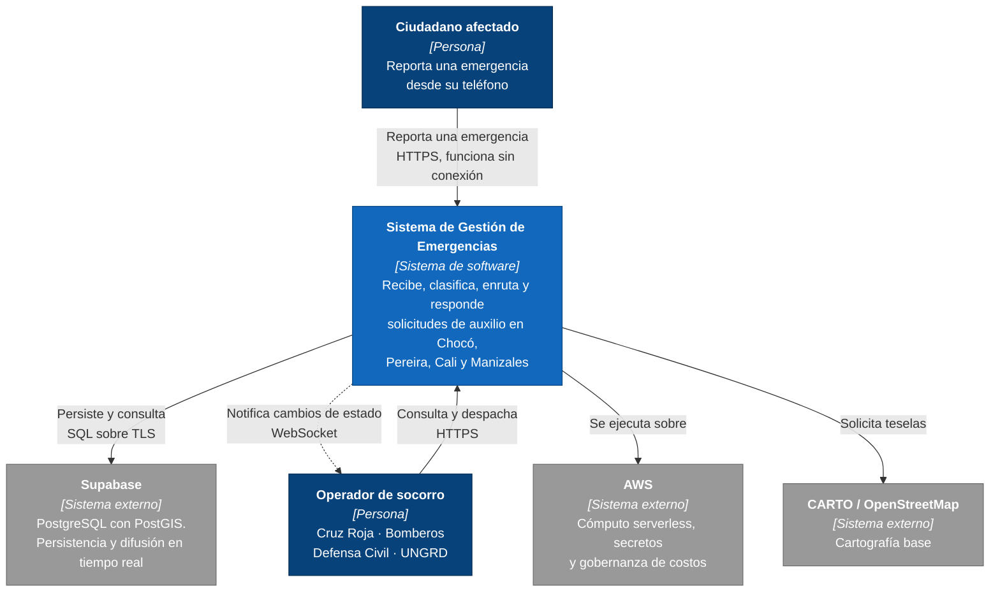
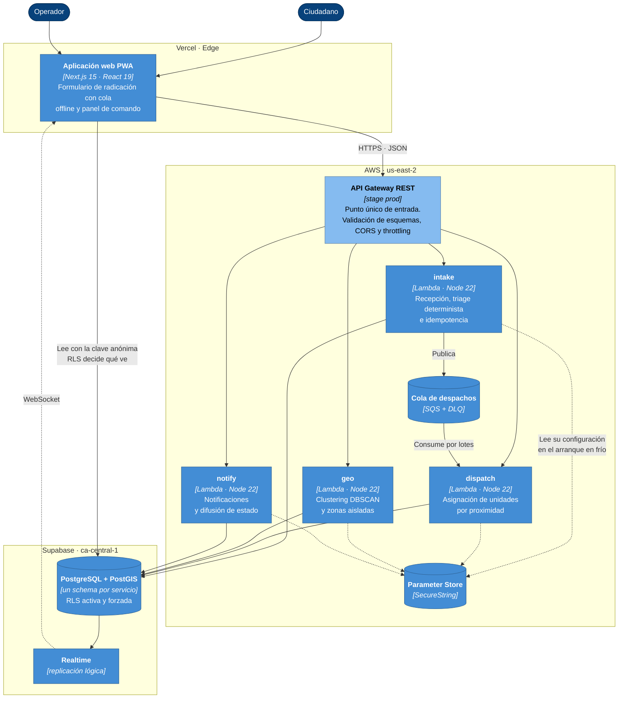
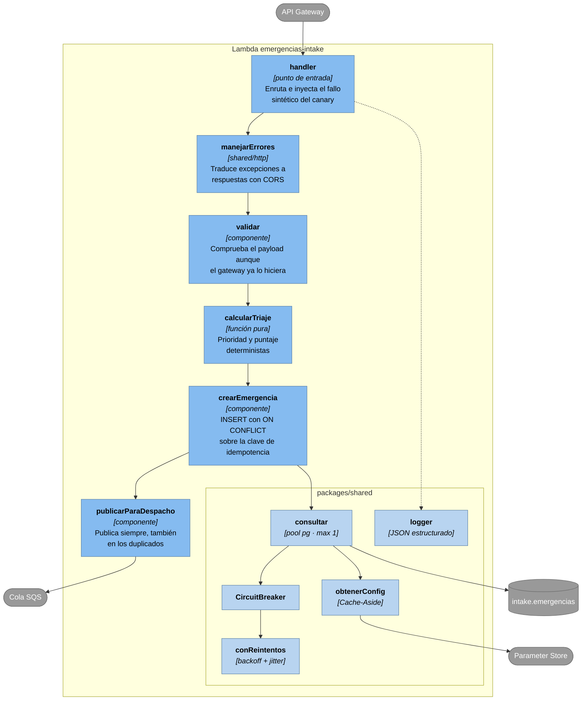
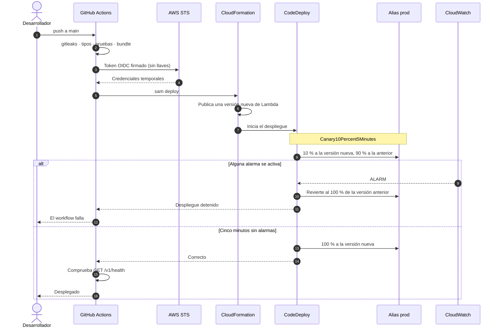
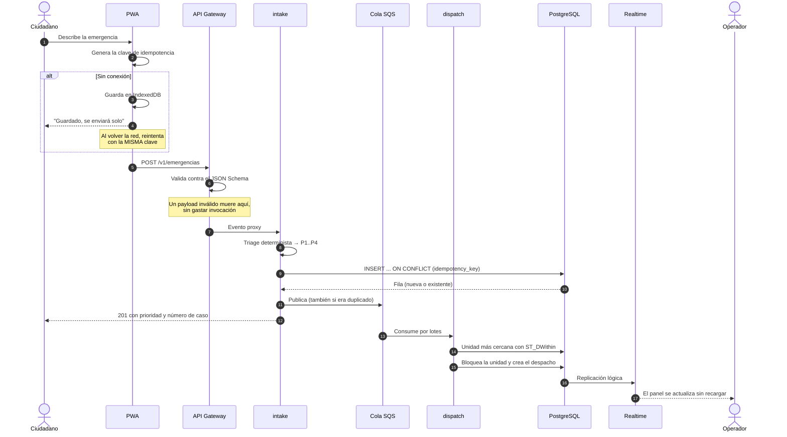

# Arquitectura — Modelo C4

Tres niveles de zoom sobre el mismo sistema: contexto, contenedores y componentes.

> **Sobre la notación.** Los diagramas usan `flowchart` de Mermaid y no la sintaxis
> `C4Context`, que sigue marcada como experimental y produce disposiciones difíciles de
> leer. El modelo C4 define **qué** hay en cada nivel y cómo se anota, no una notación
> concreta; cada elemento lleva aquí su tipo y su tecnología, que es lo que el modelo pide.
> La ventaja práctica es que estos diagramas se renderizan en GitHub sin sorpresas.

---

## Nivel 1 — Contexto

Quién usa el sistema y con qué se habla por fuera.

**Lo que conviene notar:** la flecha de vuelta hacia el operador es punteada y sale del
sistema, no del operador. Es la difusión en tiempo real: el panel no pregunta cada pocos
segundos si hay novedades, las recibe. El enunciado lo pide explícitamente.

---

## Nivel 2 — Contenedores

Las unidades desplegables por separado y cómo se comunican.

**Tres cosas que este nivel deja ver y que son decisiones, no accidentes:**

- **La cola está entre `intake` y `dispatch`, no entre el gateway y los servicios.** Es
  donde de verdad hay riesgo de avalancha: recibir un reporte es barato, asignar una
  unidad implica una consulta geoespacial y una transacción con bloqueo.
- **El frontend lee de Supabase pero escribe por el gateway.** Las reglas de negocio
  —triage, idempotencia, despacho— viven en los microservicios; permitir escrituras
  directas las dejaría fuera del camino.
- **Cada servicio tiene su propia flecha a Parameter Store**, y su rol IAM solo alcanza su
  prefijo. No hay una configuración común que todos puedan leer.

---

## Nivel 3 — Componentes de `intake`

Se desglosa `intake` por ser el más rico; los otros tres siguen la misma estructura.

**`calcularTriaje` es una función pura y eso es deliberado.** El enunciado exige un triage
determinista, y la única forma de demostrarlo es que no dependa de reloj, azar ni estado
externo. Por eso se puede probar sin base de datos: los tests le pasan el mismo payload
cincuenta veces y comprueban que el resultado no varía.

---

## Flujo de despliegue Canary

Lo que ocurre desde un `git push` hasta que el tráfico llega a la versión nueva —o vuelve
a la anterior.

Las tres alarmas que vigilan la ventana:

| Alarma | Métrica | Umbral |
|---|---|---|
| `emergencias-<svc>-errores` | `AWS/Lambda Errors` sobre el alias | ≥ 1 en 1 min |
| `emergencias-<svc>-latencia` | `AWS/Lambda Duration` p95 | > 1500 ms (3000 en `geo`) |
| `emergencias-intake-api-5xx` | `AWS/ApiGateway 5XXError` | ≥ 1 en 1 min |
| `emergencias-dispatch-dlq` | Mensajes en la cola de muertos | ≥ 1 |

Las tres llevan `TreatMissingData: notBreaching`. Es el detalle que más veces rompe esta
configuración en la práctica: una alarma que se queda en `INSUFFICIENT_DATA` nunca dispara
la reversión, y el despliegue defectuoso pasa como si nada.

La evidencia de una reversión real está en
[`rollback-canary.md`](evidencias/rollback-canary.md): 2 minutos y 44 segundos desde el
despliegue defectuoso hasta el servicio recuperado, sin intervención humana.

---

## Flujo de un reporte, de principio a fin

**El paso 11 es el que suele estar mal en implementaciones parecidas.** Publicar solo
cuando la fila es nueva parece lo lógico y esconde un fallo grave: si el `INSERT` funciona
y la publicación falla, el cliente reintenta, encuentra el duplicado, y esa emergencia se
queda registrada para siempre sin que nadie la despache. Publicar siempre cierra el hueco,
y `dispatch` ya es idempotente.
